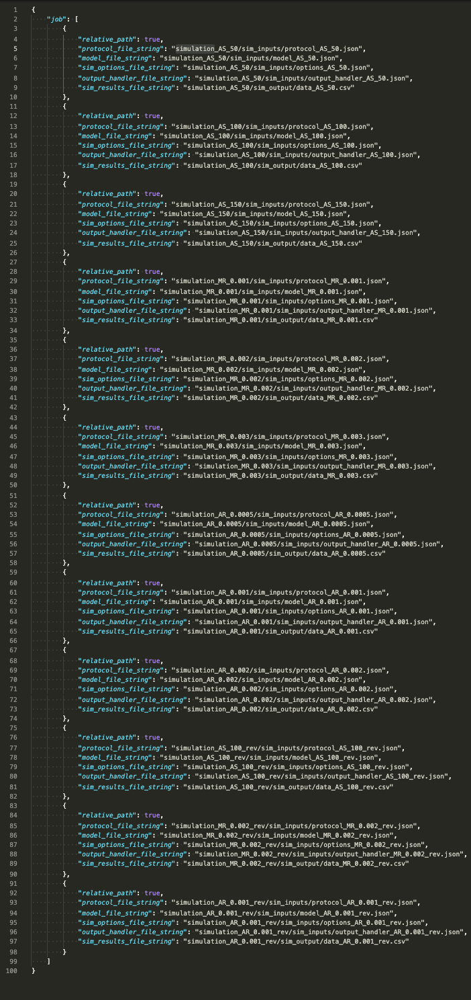

# paper_PyMyoVent_growth_valve
This repository holds essential files for the growth paper due to valvular disorders with PyMyoVent submitted to Frontiers in Physiology. 

- To reproduce all figures shown in the paper, you need to follow the below steps:

In general, the whole proccess can be divided into three main steps:

| **Step Number** | **Description** |
| ------ | ------- |
| 1 | Generating a batch file of required input files for PyMyoVent |
| 2 | Running PyMyoVent using generated input files in step 1. |
| 3 | Generate figures using simulated raw data from step 2. |  

Let's start ....

## Step1: Generating a batch file of required input files for PyMyoVent

1. First clone the repository on your local computer.

2. On your computer terminal prompt, navigate to the folder where the repositore is already stored:
- `$cd <path_to_repo_on_your_computer>`

3. Handle all required dependencies for generating figures by running the following command in terminal prompt:
- `$ pip install -r requirements.txt`

4. After successfully installing the required packages, you can generate a batch file for all simulations used in this paper by doing following steps:  
- Navigate to the `simulations` folder in the repository : `$cd simulations`. 
- Run the python file `batch_generator.py` via following command:
`$ python batch_generator.py`
- In couple of second you should see a batch file named `batch.json` along all folders containing the required "input" files are generated in `simulations` folder. The `batch.json` file would look like this:

## Step2: Running PyMyoVent using generated input files in step 1.
1. you need to find out the absolute path to your `batch.json` file in the `simulations` folder. To do that:

    - On your terminal prompt, while you are in the `simulations` folder run the following command: 
        - mac: `$ pwd` 
        - windows: `$cd`
    - In a second, the absolute path to the `simulations` file would be shown on your terminal prompt:
    
